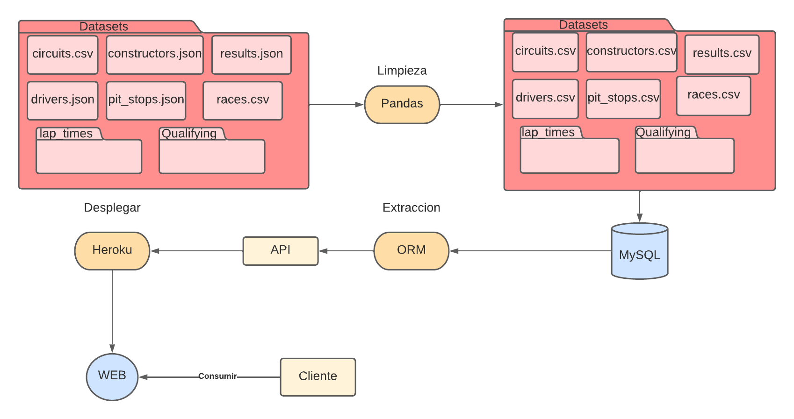
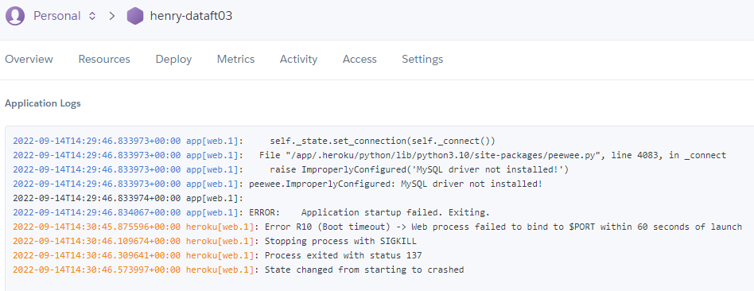
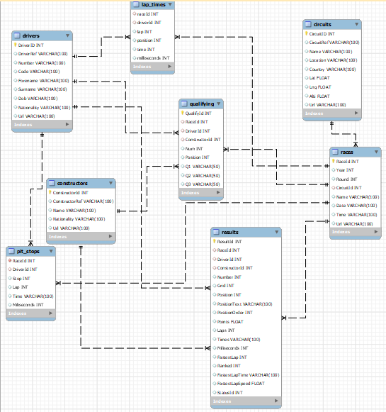

# PI01_DATA03 -- Huarcaya Tacas Edward
### Flujo del proceso de limpieza y creacion de la API

  

## URL-Video
https://youtu.be/IvJY9dhEp4g
## Objetivo
Extraer la data para su posterior limpieza y normalizacion, luego mandarlo a mysql y de ahi a una API para un uso a futuro.

## Limitaciones
* La herramienta **Heroku** me arroja algunos errores que por mas que busco no encuentro, por eso mi proyecto individual es una simulacion como si la API estuviera levantada y lista para su consumo. 
  

## Herramientas usadas
* Pandas
* Numpy
* Mysql
* Peewee(ORM)
* FastApi
* Uvicorn

## Guia de directorios
1. **Datasets:** Datos originales
2. **Clean:** Noteboocks que utilice para limpiar la data
3. **CleanDataSets:** Datos limpiados y enviados a MySQL
4. **MySQL:** Script Mysql. *Util para la extraccion con peewee*
5. **ORM:** Extraccion de la data alojada en Mysql
6. **ConsumirAPI:** Desde aqui es donde hago el consumo de la API **(simulacion)** y resuelvo las preguntas 

## Archivo principal
> Method_get.py : Desde aqui es donde utilizamos el metodo GET para enviar la data

## Archivos otros
* Tanto **Procfile** como **requeriments.txt** fueron creados para que **Heroku** pueda desplegar la API

### Visualizacion de las realaciones SQL
  

